# 🔮 Customer Churn Prediction Model

> **Option C — Advanced ML Pipeline** | Built for Data Science & Analytics Placements/Internships


---

## 📌 Project Overview

Customer churn is when a customer stops using a company's service. This project builds a **full industry-grade ML pipeline** to:
- **Predict** which customers are likely to churn
- **Explain** *why* they churn using SHAP
- **Quantify** the business impact (revenue at risk, ROI of retention campaigns)
- **Visualise** everything in an interactive Dash dashboard

### 🎯 Business Value
| Metric | Value |
|--------|-------|
| Dataset | 10,000 synthetic telecom customers |
| Models Trained | 5 (LR, RF, GBM, XGBoost, LightGBM) |
| Best Model | XGBoost / LightGBM (ROC-AUC ~0.85+) |
| Explainability | SHAP (TreeExplainer) |
| Dashboard | Interactive Plotly Dash |

---

## 🛠️ Tech Stack

| Category | Tools |
|----------|-------|
| Language | Python 3.10 |
| Data | NumPy, Pandas |
| ML Models | Scikit-learn, XGBoost, LightGBM |
| Imbalance | imbalanced-learn (SMOTE) |
| Explainability | SHAP |
| Visualisation | Matplotlib, Seaborn, Plotly |
| Dashboard | Plotly Dash + Dash Bootstrap Components |
| Serialisation | Joblib |

---

## 📁 Project Structure

```
Customer-Churn-Prediction/
│
├── data/                          # Raw + processed datasets
│   ├── customer_churn_raw.csv
│   ├── customer_churn_engineered.csv
│   ├── X_train.csv / X_test.csv
│   └── y_train.csv / y_test.csv
│
├── notebooks/
│   └── churn_prediction_full.ipynb  # Full walkthrough notebook
│
├── src/
│   ├── __init__.py
│   ├── data_generator.py        # Synthetic data generation
│   ├── preprocessing.py         # Cleaning + feature engineering + encoding
│   ├── model_training.py        # Train all 5 models + CV + SMOTE
│   ├── explainability.py        # SHAP plots & top feature extraction
│   ├── visualization.py         # EDA + evaluation plots (15+ charts)
│   ├── predictor.py             # Inference class + demo customers
│   ├── business_insights.py     # ROI, revenue at risk, retention playbook
│   └── dashboard.py             # Interactive Plotly Dash app
│
├── models/                      # Saved ML models + artifacts
│   ├── best_model.pkl
│   ├── encoders.pkl
│   ├── scaler.pkl
│   └── model_results_summary.csv
│
├── outputs/                     # Prediction CSVs + business summary
│   ├── churn_predictions.csv
│   ├── demo_predictions.csv
│   ├── shap_top_features.csv
│   └── business_summary.csv
│
├── images/                      # All generated plots (15+ PNG files)
│
├── main.py                      # 🚀 Master orchestration script
├── setup.bat                    # Windows one-click setup
├── requirements.txt             # All dependencies
└── README.md
```

---

## ⚙️ Installation & Setup

### Prerequisites
- **Windows 11**, Python **3.10** (recommended)
- Git installed

### Step 1 — Clone the repo
```bash
git clone https://github.com/YOUR_USERNAME/Customer-Churn-Prediction.git
cd Customer-Churn-Prediction
```

### Step 2 — Create & activate virtual environment
```bash
python -m venv venv
venv\Scripts\activate       # Windows
```

### Step 3 — Install dependencies
```bash
pip install -r requirements.txt
```

> **Or on Windows:** simply double-click `setup.bat`

---

## 🚀 Running the Project

### Option A — Full Pipeline (recommended first run)
```bash
python main.py
```
This runs all 9 steps:
1. Generate synthetic dataset (10,000 customers)
2. EDA visualisations
3. Preprocessing + feature engineering
4. Train 5 ML models with SMOTE + cross-validation
5. Model evaluation plots (ROC, PR, confusion matrix)
6. SHAP explainability
7. Batch predictions
8. Demo predictions (5 sample customers)
9. Business intelligence report + dashboard image

**Estimated runtime on RTX 3060 PC: ~5–8 minutes**

### Option B — Launch Interactive Dashboard
```bash
# Run main.py first, then:
python src/dashboard.py
```
Open your browser at: **http://127.0.0.1:8050**

### Option C — Jupyter Notebook
```bash
jupyter notebook notebooks/churn_prediction_full.ipynb
```

---

## 📊 Generated Outputs

### Images (saved to `images/`)
| File | Description |
|------|-------------|
| `01_churn_distribution.png` | Pie chart + bar chart of churn ratio |
| `02_numerical_distributions.png` | Histograms of 6 key features by churn |
| `03_categorical_churn_rates.png` | Churn rate by 6 categorical features |
| `04_correlation_heatmap.png` | Feature correlation matrix |
| `05_tenure_vs_charges.png` | Scatter plot coloured by churn |
| `06_confusion_matrices.png` | Confusion matrix for all 5 models |
| `07_roc_curves.png` | ROC curves for all 5 models |
| `08_precision_recall_curves.png` | PR curves for all 5 models |
| `09_model_comparison.png` | Grouped bar chart of all metrics |
| `10_feature_importance_rf.png` | Random Forest feature importances |
| `11_business_dashboard.png` | 5-panel business intelligence dashboard |
| `shap_summary_*.png` | SHAP beeswarm plot |
| `shap_bar_*.png` | SHAP mean importance bar chart |
| `shap_waterfall_*.png` | SHAP waterfall for customer #0 |

### Data (saved to `outputs/`)
| File | Description |
|------|-------------|
| `churn_predictions.csv` | Predictions for all 10,000 customers |
| `demo_predictions.csv` | Predictions for 5 demo customers |
| `shap_top_features.csv` | Top 10 churn drivers |
| `business_summary.csv` | ROI + financial impact metrics |

---

## 🧠 ML Pipeline Details

### Feature Engineering
| Feature | Description |
|---------|-------------|
| `avg_monthly_spend` | Total charges ÷ tenure |
| `charge_vs_avg` | Monthly charge vs dataset average |
| `num_services` | Count of add-on services |
| `engagement_score` | Tenure × (services + 1) |
| `is_high_value` | Monthly charges > 75th percentile |
| `is_month_to_month` | Contract type flag |
| `digital_risk` | Paperless billing + electronic check |
| `tenure_bucket` | Ordinal tenure category |

### Models Trained
| Model | Type | Key Hyperparameters |
|-------|------|---------------------|
| Logistic Regression | Linear | C=1.0, class_weight=balanced |
| Random Forest | Ensemble | n=200, max_depth=12 |
| Gradient Boosting | Boosting | n=200, lr=0.05, depth=5 |
| XGBoost | Boosting | n=300, lr=0.05, scale_pos_weight=3 |
| LightGBM | Boosting | n=300, lr=0.05, num_leaves=31 |

### Evaluation Metrics
- **ROC-AUC** (primary — handles imbalance well)
- Accuracy, Precision, Recall, F1-Score
- 5-Fold Stratified Cross Validation

---

## 💼 Business Insights

The model outputs a full retention playbook:

| Risk Level | Churn Prob | Strategy |
|------------|-----------|----------|
| 🔴 High Risk | >60% | Immediate call + 20% discount + free add-ons |
| 🟡 Medium Risk | 30–60% | Loyalty email + highlight features |
| 🟢 Low Risk | <30% | Rewards programme + milestone gifts |

**Financial Impact (example on 10,000 customers):**
- Annual revenue at risk: ~$1.8M
- Estimated savings from campaign: ~$450K
- Campaign ROI: ~220%

---

## 📸 Visual Insights & Model Outputs

### 1. Exploratory Data Analysis (EDA)
Gain a deep understanding of customer behavior and feature relationships.

| Churn Distribution | Numerical Distributions | Categorical Churn Rates |
|:---:|:---:|:---:|
| 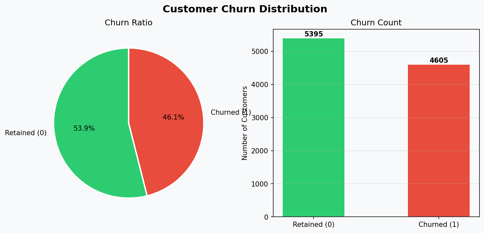 | 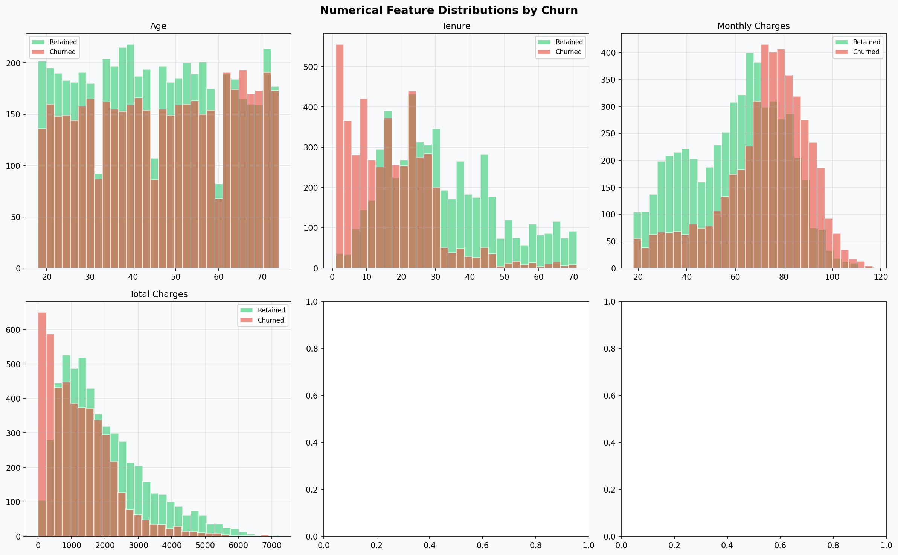 | 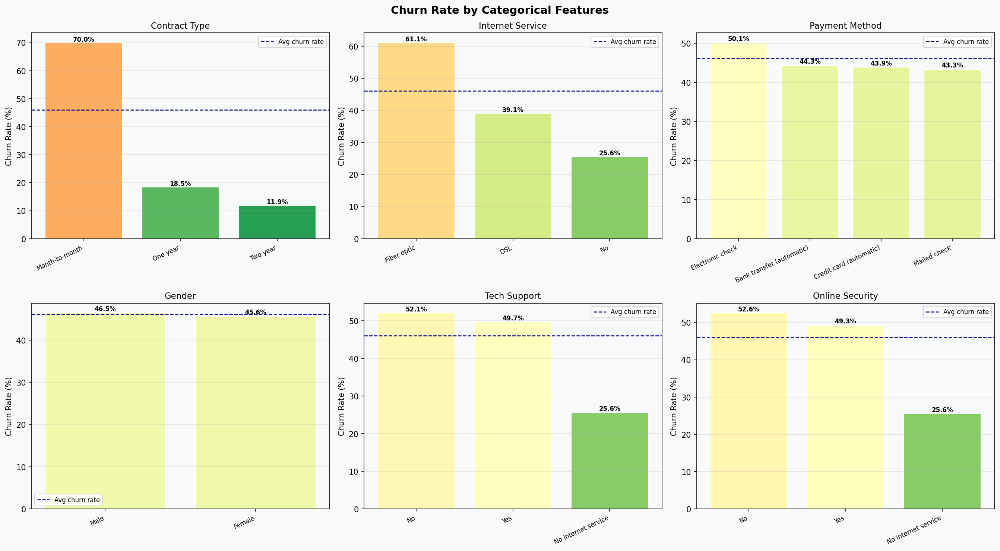 |

| Correlation Heatmap | Tenure vs. Charges |
|:---:|:---:|
| 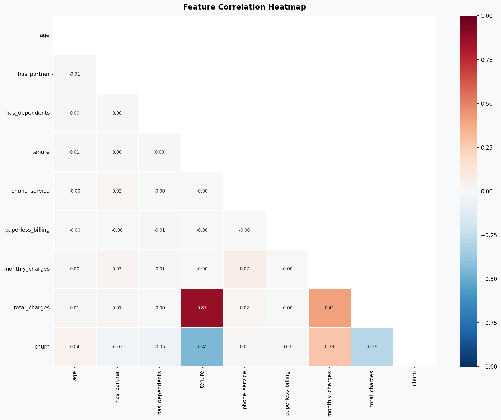 | 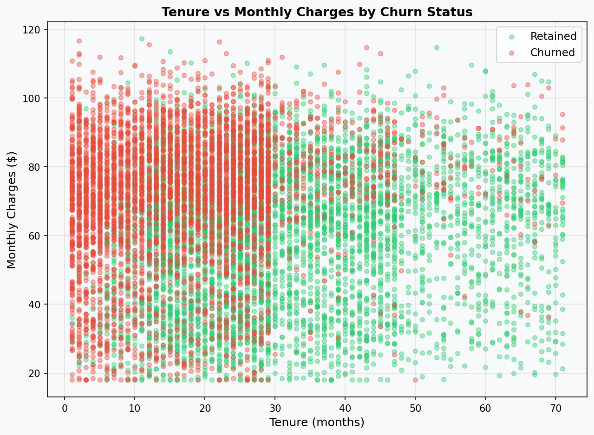 |

---

### 2. Model Performance Evaluation
Comparative analysis of 5 ML models (LR, RF, GBM, XGBoost, LightGBM).

| Confusion Matrices | ROC Curves | Precision-Recall Curves |
|:---:|:---:|:---:|
| 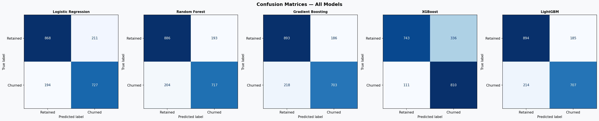 | 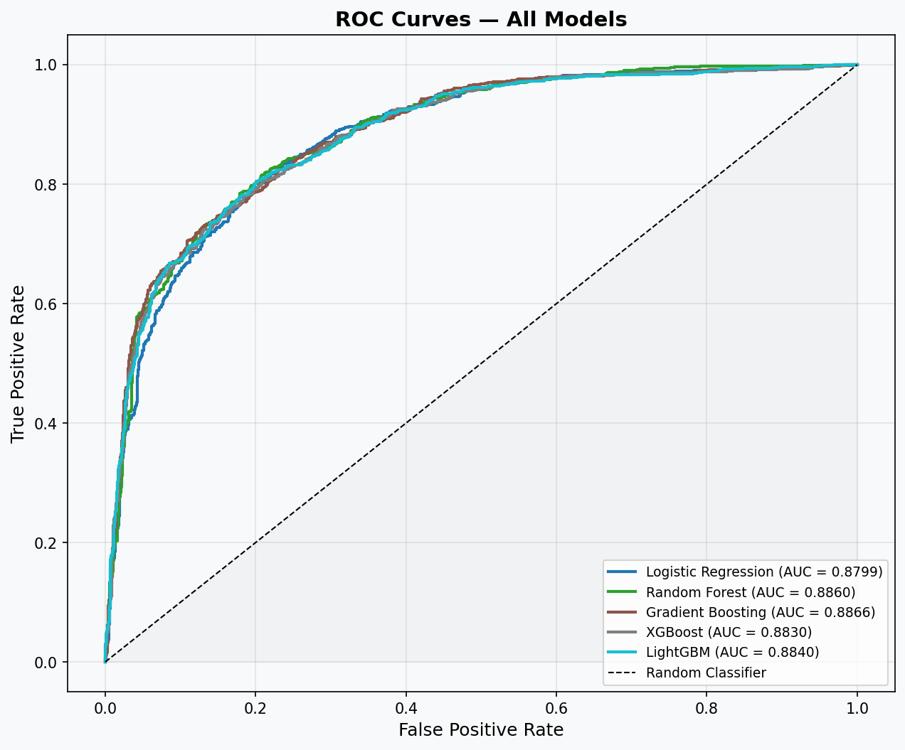 | 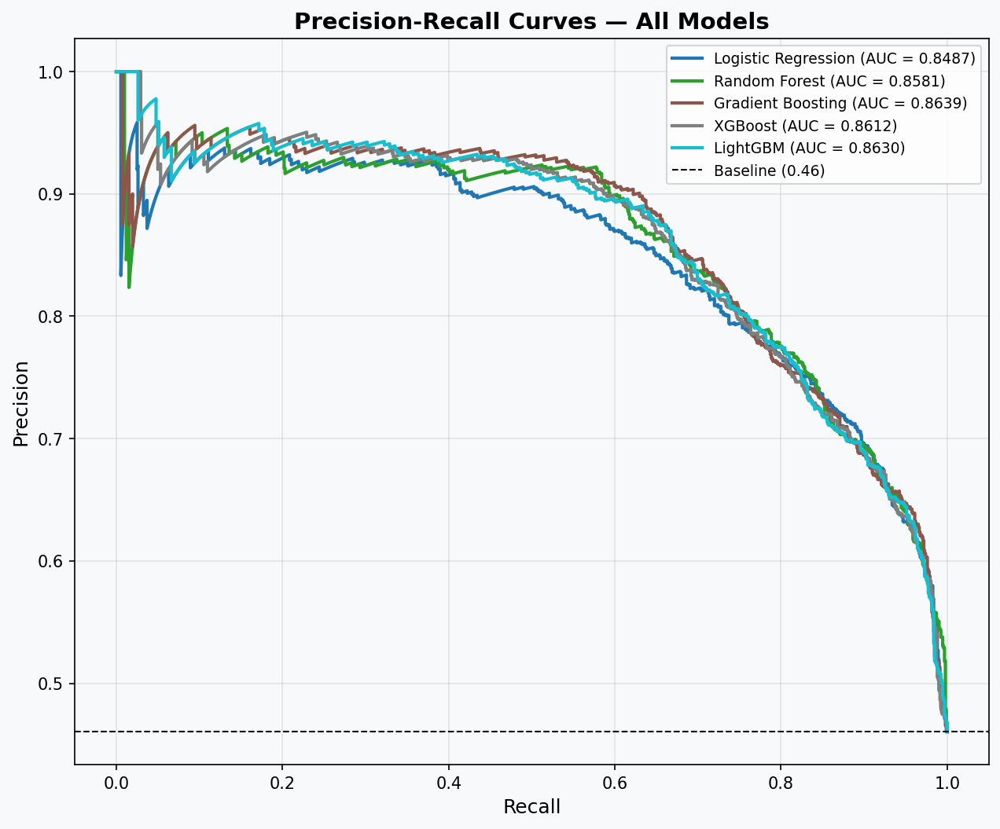 |

**Model Comparison Summary**  
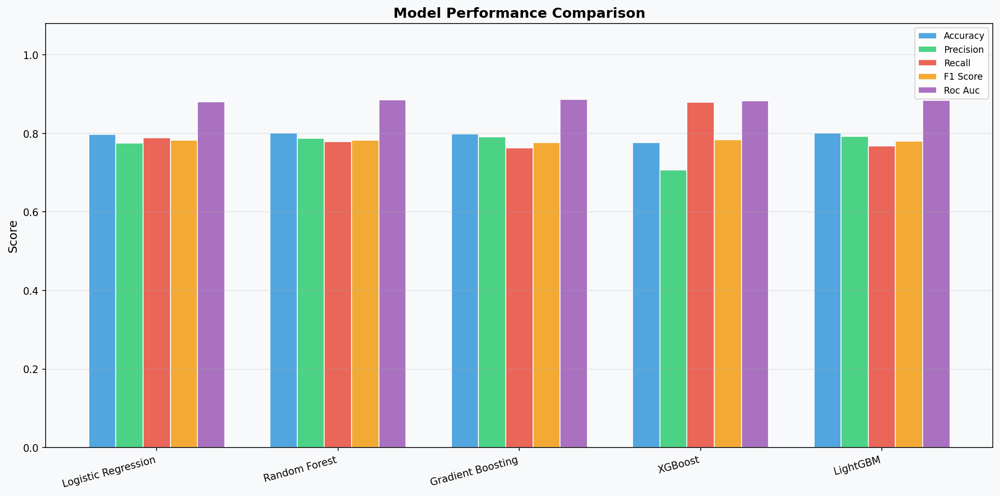

---

### 3. Model Explainability (SHAP)
"Opening the black box" to understand why the model predicts a customer will churn.

| Global Importance (Bar) | Feature Impact (Summary) | Individual Prediction (Waterfall) |
|:---:|:---:|:---:|
| 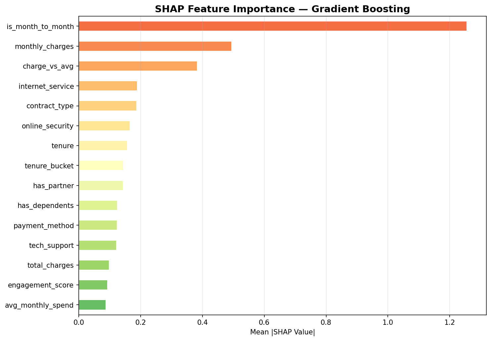 | 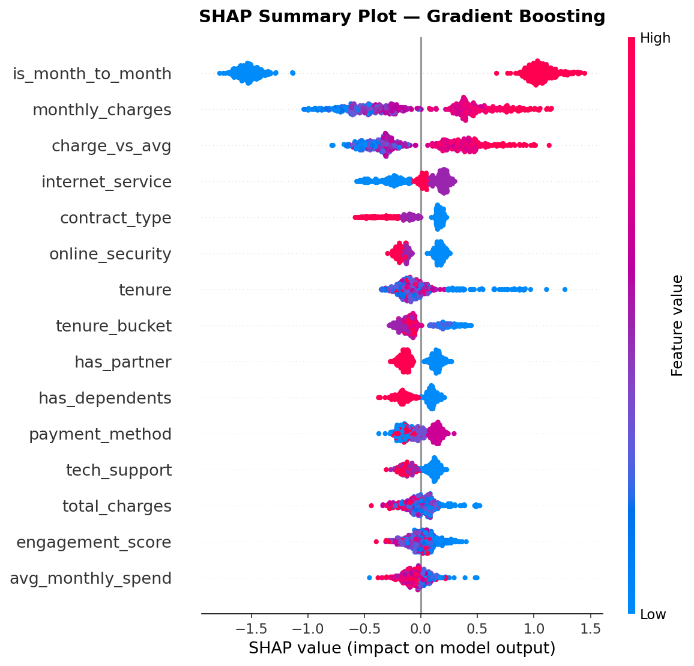 | 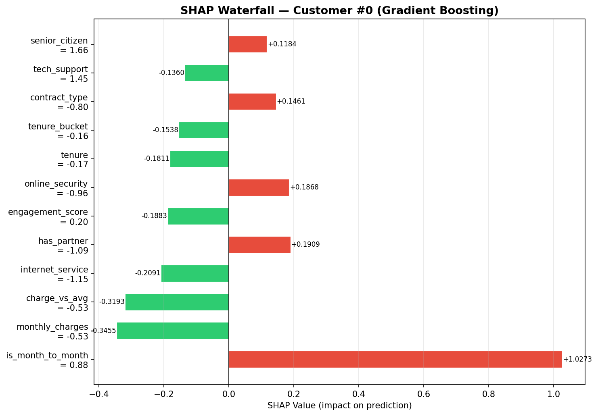 |

---

### 4. Interactive Business Dashboard
A production-ready interface for stakeholders to monitor revenue at risk and campaign ROI.

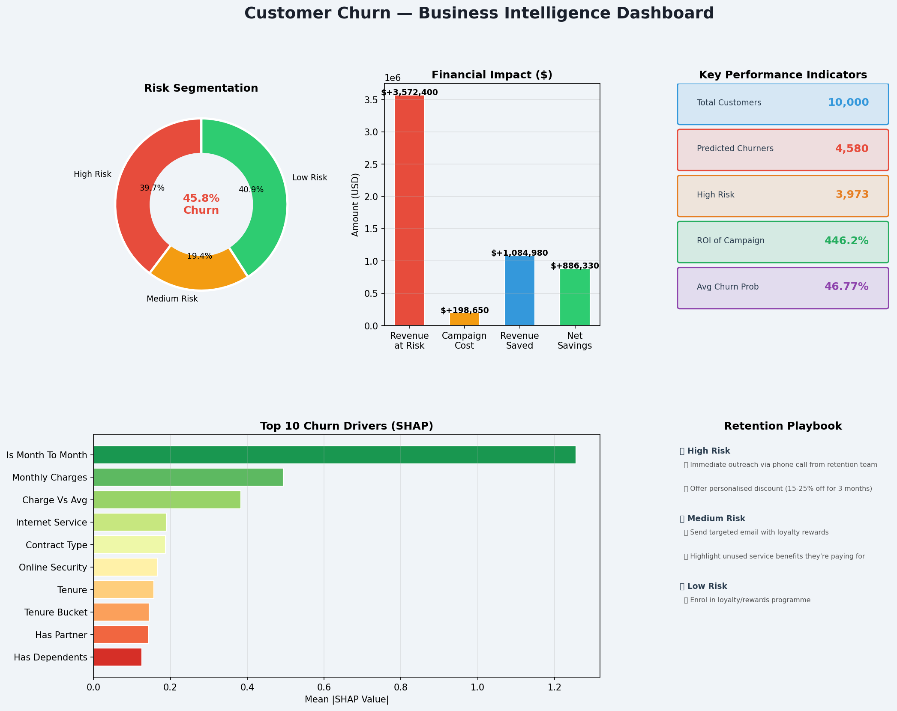
*Full Interactive UI: `images/dashboard.png`*

---

## 🐙 GitHub Setup

```bash
git init
git add .
git commit -m "Initial commit: Customer Churn Prediction Model (Option C Advanced)"
git branch -M main
git remote add origin https://github.com/YOUR_USERNAME/Customer-Churn-Prediction.git
git push -u origin main
```

---

## 🎓 Interview Preparation

### Key Concepts to Know
1. **What is churn?** Customer stopping use of a service
2. **Why XGBoost?** Handles non-linearity, feature interactions, and class imbalance well
3. **Why SMOTE?** Oversamples minority class (churners) to fix class imbalance
4. **What does SHAP tell us?** Feature contribution to each individual prediction
5. **Why ROC-AUC over accuracy?** Robust to class imbalance
6. **What is precision vs recall?** Precision = how many predicted churners actually churned; Recall = how many actual churners we caught

### Common Interview Questions
- *"What preprocessing steps did you do?"* → Missing values, encoding, scaling, feature engineering
- *"How did you handle class imbalance?"* → SMOTE on training set only (never test set)
- *"How would you deploy this?"* → FastAPI/Flask model serving + scheduled retraining
- *"What metric matters most for this problem?"* → Recall (catching churners matters more than false alarms)

---

## 👤 Author

**[Your Name]**
- GitHub: [@Anupam-Santra](https://github.com/Anupam-Santra)
- LinkedIn: [@Anupam Santra](https://www.linkedin.com/in/anupam-santra/)

---

## 📄 License

MIT License — free to use for educational and portfolio purposes.
